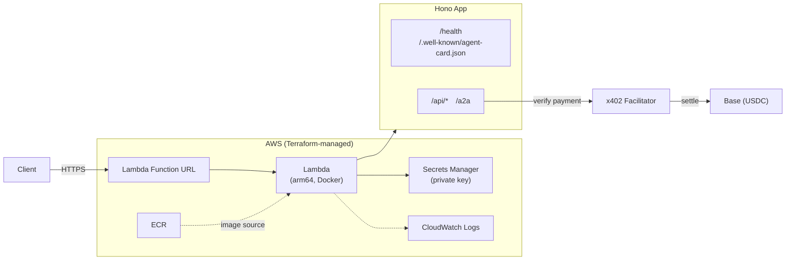
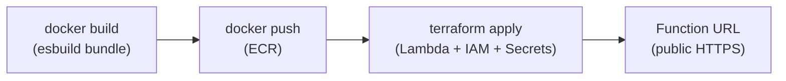
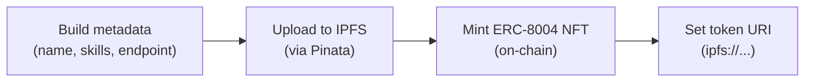
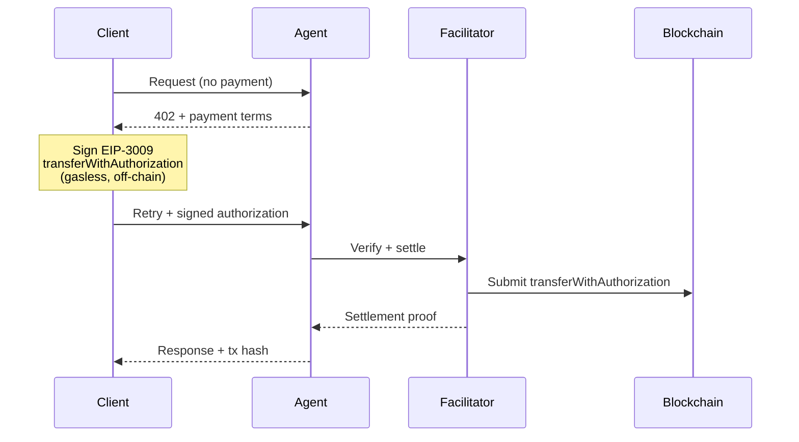

# A2A x402 Agent Template

[](LICENSE)
[](https://nodejs.org)
[](https://vitest.dev)

A production-ready template for building **AI agents that accept on-chain payments**. Combines [Hono](https://hono.dev) (web framework), [x402](https://www.x402.org) (HTTP 402 payment protocol), [A2A](https://google.github.io/A2A/) (Agent-to-Agent protocol), and [ERC-8004](https://eips.ethereum.org/EIPS/eip-8004) (on-chain agent identity) into a serverless agent that deploys to AWS Lambda in one command.

Pre-configured for **Base Sepolia** (testnet) — switch to Base Mainnet by changing two env vars (see [Network Switching](#network-switching)). Designed to be consumed by AI agents: ships with [`AGENT.md`](AGENT.md) so tools like [OpenClaw](https://openclaw.ai) can index and interact with this repo out of the box.

## Architecture Overview



Terraform manages all AWS infrastructure: Lambda function, ECR image repository, Secrets Manager (private key), IAM roles, CloudWatch log group, and the Function URL endpoint. Endpoints split into **free** (`/health`, agent card, read-only A2A methods) and **paid** (`/api/*`, A2A `message/send` and `message/stream`) — see [How Payments Work](#how-payments-work) for the full x402 sequence.

## What's Inside

| Library | Package | What it does |
|---------|---------|-------------|
| **[Hono](https://hono.dev)** | `hono` | Ultrafast web framework. Runs on Node.js, AWS Lambda, Deno, Bun, Cloudflare Workers — same code everywhere. |
| **[x402](https://www.x402.org)** | `@x402/hono` `@x402/core` `@x402/evm` | HTTP 402 payment protocol. Clients pay with on-chain USDC, a facilitator verifies payment, your agent gets paid. |
| **[A2A](https://google.github.io/A2A/)** | `@a2a-js/sdk` | Google's Agent-to-Agent protocol. Standardized JSON-RPC interface so agents can discover and talk to each other. |
| **[ERC-8004](https://eips.ethereum.org/EIPS/eip-8004)** | `agent0-sdk` | On-chain agent identity. Mints an NFT with IPFS metadata pointing to your agent's live endpoint. |

## Prerequisites

- **Node.js 22+** and npm
- **AWS CLI** configured (`aws configure`)
- **Terraform** (for Lambda deployment)
- **Docker** (for building the Lambda container image)
- **Pinata account** (free tier works — needed only for ERC-8004 identity registration)

## Quick Start

### 1. Clone and install

```bash
git clone https://github.com/wgopar/a2a-x402-agent-template.git
cd a2a-x402-agent-template
npm install
```

### 2. Create a wallet

```bash
npm run create-wallet -- my-agent
```

This generates a new Ethereum wallet and writes the address + private key to both `.env` (local dev) and `infra/terraform.tfvars` (Lambda deploy). It also sets `function_name` in tfvars, which names all AWS resources (Lambda, ECR, IAM roles). **Use a unique name per agent** to prevent resource collisions. Both files are gitignored.

> **Next:** Fund the wallet with testnet ETH from a [Base Sepolia faucet](https://www.coinbase.com/faucets/base-ethereum-goerli-faucet).

### 3. Configure environment

The wallet script pre-fills most values. Review `.env` and adjust if needed:

```bash
# .env (auto-generated, gitignored)
WALLET_ADDRESS=0x...          # from create-wallet
PRIVATE_KEY=0x...             # from create-wallet
NETWORK=eip155:84532          # Base Sepolia (testnet)
RPC_URL=https://sepolia.base.org
FACILITATOR_URL=https://www.x402.org/facilitator
AGENT_NAME=Hello Agent
AGENT_URL=http://localhost:3000
PORT=3000
```

See [Configuration Reference](#configuration-reference) for all available variables.

### 4. Run locally

```bash
npm run dev
```

### 5. Test endpoints

```bash
# Health check (always free)
curl http://localhost:3000/health

# Agent card (always free)
curl http://localhost:3000/.well-known/agent-card.json

# Paid endpoint — returns 402 with payment terms
curl -i http://localhost:3000/api/hello
```

The `/api/hello` response includes a `402 Payment Required` status with an `x-payment-required` header containing the payment terms (price, network, asset, payTo address).

## Deploy to AWS Lambda

### First-time setup

Make sure you've run `npm run create-wallet -- <name>` first — it sets `function_name` in `terraform.tfvars`, which is **required** and names all AWS resources.

```bash
cd infra && terraform init
terraform apply -target=aws_ecr_repository.agent   # create ECR repo
cd ..
```

### Deploy

```bash
npm run deploy
```

This builds a Docker image, pushes to ECR, and runs `terraform apply` — your agent is live. Terraform stores your private key in **AWS Secrets Manager** (not as a Lambda environment variable), so it's encrypted at rest and accessed via IAM at runtime.



### Verify

```bash
# Get your Function URL from terraform output
cd infra && terraform output function_url

# Test it
curl https://<your-function-url>/health
curl https://<your-function-url>/.well-known/agent-card.json
```

## Register On-Chain Identity (Optional)

ERC-8004 registration mints an NFT that points to your agent's live endpoint via IPFS metadata. This enables on-chain agent discovery.

### 1. Get a Pinata JWT

Sign up at [pinata.cloud](https://www.pinata.cloud), create an API key, and add the JWT to `.env`:

```bash
PINATA_JWT=your-pinata-jwt
```

### 2. Set your agent URL

Point `AGENT_URL` in `.env` to your deployed Lambda Function URL (not localhost):

```bash
AGENT_URL=https://<your-function-url>
```

### 3. Register

```bash
npm run register
```



### 4. Verify

Anyone can now discover your agent on-chain:

```
tokenURI(tokenId) → ipfs://... → metadata JSON → services[0].endpoint → your agent
```

## How Payments Work

The x402 protocol uses **gasless payments**. Clients never submit blockchain transactions — they sign an off-chain [EIP-3009](https://eips.ethereum.org/EIPS/eip-3009) `transferWithAuthorization`, and the facilitator settles on-chain on their behalf.



| Endpoint | Payment |
|----------|---------|
| `GET /health` | Free |
| `GET /.well-known/agent-card.json` | Free |
| `POST /a2a` — `tasks/get`, `tasks/cancel` | Free |
| `POST /a2a` — `message/send`, `message/stream` | **$0.01 USDC** |
| `GET /api/hello` | **$0.01 USDC** |

Read-only A2A methods are always free. Only work-producing methods (`message/send`, `message/stream`) require payment.

## Customize Your Agent

Three files to edit:

### `src/agent/skills.ts` — Define skills

```typescript
export const skills: AgentSkill[] = [
  {
    id: "my-skill",
    name: "My Skill",
    description: "What this skill does",
    tags: ["tag1", "tag2"],
    examples: ["Do the thing", "Another example"],
  },
];
```

### `src/agent/executor.ts` — Implement logic

```typescript
export class MyExecutor implements AgentExecutor {
  async execute(
    requestContext: RequestContext,
    eventBus: ExecutionEventBus,
  ): Promise<void> {
    // Your agent logic here
    const response: Message = {
      kind: "message",
      messageId: uuidv4(),
      role: "agent",
      parts: [{ kind: "text", text: "Your response" }],
      contextId: requestContext.contextId,
    };
    eventBus.publish(response);
    eventBus.finished();
  }
}
```

### `src/routes/api.ts` — Add HTTP endpoints

```typescript
api.get("/my-endpoint", (c) => {
  return c.json({ data: "your response" });
});
```

New routes under `/api/*` are automatically payment-gated. Update the price in `src/app.ts` if needed.

## Project Structure

```
├── src/
│   ├── app.ts              # Composition root — middleware chain + routes
│   ├── config.ts           # Environment config (async for Secrets Manager)
│   ├── server.ts           # Node.js entrypoint (local dev)
│   ├── lambda.ts           # AWS Lambda entrypoint (lazy init)
│   ├── agent/
│   │   ├── card.ts         # AgentCard builder
│   │   ├── executor.ts     # ★ Task execution logic (customize this)
│   │   └── skills.ts       # ★ Skill definitions (customize this)
│   ├── a2a/
│   │   └── handler.ts      # A2A JSON-RPC handler + agent card endpoint
│   ├── payments/
│   │   └── x402.ts         # x402 payment middleware factory
│   ├── routes/
│   │   ├── api.ts          # ★ Paid HTTP routes (customize this)
│   │   └── health.ts       # Health check
│   └── identity/
│       └── erc8004.ts      # ERC-8004 registration (agent0-sdk)
├── scripts/
│   ├── create-wallet.ts    # Generate wallet + set function_name → .env + terraform.tfvars
│   ├── register-identity.ts# Register on-chain identity
│   └── deploy.sh           # Build + push + terraform apply
├── infra/
│   ├── main.tf             # Lambda, ECR, IAM, Secrets Manager
│   ├── variables.tf        # Terraform variable definitions
│   ├── outputs.tf          # Terraform outputs (function URL, etc.)
│   └── terraform.tfvars.example
├── test/                   # Vitest tests
├── .env.example            # Environment template
├── Dockerfile              # Multi-stage (lambda default, server for ECS)
└── tsconfig.json
```

Files marked with **★** are the ones you customize.

## Configuration Reference

| Variable | Required | Default | Description |
|----------|----------|---------|-------------|
| `WALLET_ADDRESS` | Yes | — | Ethereum wallet address |
| `PRIVATE_KEY` | Yes (local dev) | — | Private key for signing. Not needed on Lambda if `PRIVATE_KEY_SECRET_ARN` is set. |
| `PRIVATE_KEY_SECRET_ARN` | Yes (Lambda) | — | AWS Secrets Manager ARN. Lambda uses this instead of `PRIVATE_KEY`. |
| `NETWORK` | No | `eip155:84532` | Chain identifier (Base Sepolia) |
| `RPC_URL` | No | `https://sepolia.base.org` | JSON-RPC endpoint |
| `FACILITATOR_URL` | No | `https://www.x402.org/facilitator` | x402 facilitator URL (testnet) |
| `AGENT_NAME` | No | `Hello Agent` | Agent display name (shown in agent card) |
| `AGENT_DESCRIPTION` | No | `A simple Hello World agent` | Agent description (shown in agent card) |
| `AGENT_URL` | No | `http://localhost:3000` | Public URL. Set to Function URL when deploying to Lambda. |
| `PORT` | No | `3000` | Local dev server port |
| `PINATA_JWT` | For registration | — | Pinata API JWT. Required only for `npm run register` (ERC-8004). |
| `AGENT_PROVIDER_NAME` | No | — | Provider org name. Requires `AGENT_PROVIDER_URL` to also be set. |
| `AGENT_PROVIDER_URL` | No | — | Provider org URL |
| `AGENT_DOCS_URL` | No | — | Documentation URL (shown in agent card) |
| `AGENT_ICON_URL` | No | — | Icon URL (shown in agent card) |

## Network Switching

The same wallet works on both testnet and mainnet. Switch by editing `.env` and `infra/terraform.tfvars`:

| | Base Sepolia (testnet) | Base Mainnet |
|---|---|---|
| `NETWORK` | `eip155:84532` | `eip155:8453` |
| `RPC_URL` | `https://sepolia.base.org` | `https://mainnet.base.org` |
| `FACILITATOR_URL` | `https://www.x402.org/facilitator` | `https://api.cdp.coinbase.com/platform/v2/x402` |

After switching, redeploy (`npm run deploy`) and re-register identity (`npm run register`) on the new network.

## Testing

```bash
npm test        # Run all tests
npm run lint    # TypeScript type check
```

Tests cover the app composition, agent card generation, executor behavior, config loading, and Lambda handler setup.

## License

[MIT](LICENSE)
